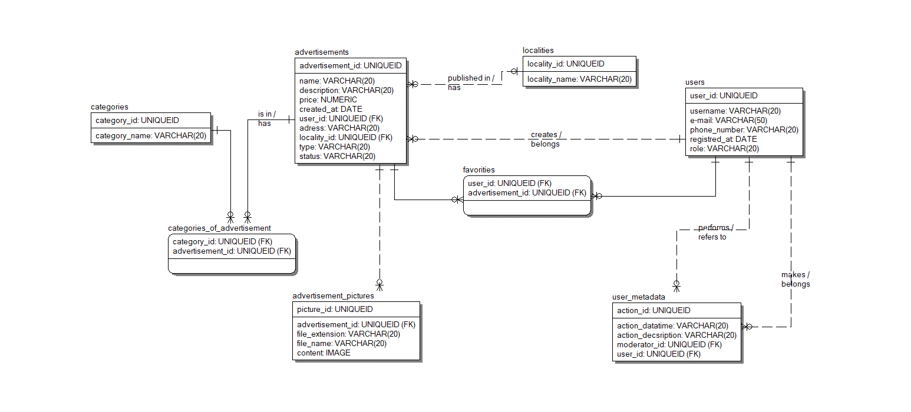

# BulletinBoard 

BulletinBoard - это веб-приложение для размещения и управления объявлениями. Платформа позволяет пользователям создавать, просматривать, редаектировать объявления, а также сохранять их в избранное.
## Типы и возможности пользователей

### Неавторизованный пользователь:
- Просмотр списка всех объявлений
- Фильтрация объявлений по категории, местоположению, дате публикации
- Просмотр подробной информации об объявлении
- Сортировка объявлений по дате, цене, местоположению
- Регистрация и авторизация в системе

### Авторизованный пользователь:
- Просмотр списка всех объявлений
- Фильтрация объявлений по категории, местоположению, дате публикации
- Просмотр подробной информации об объявлении
- Сортировка объявлений по дате, цене, местоположению
- Создание новых объявлений с заголовком, описанием, ценой, фотографиями
- Редактирование и удаление собственных объявлений
- Добавление/удаление объявлений в/из избранного
- Просмотр списка избранных объявлений
- Просмотр созданных объявлений

### Модератор:
- Просмотр списка всех объявлений и метаданных пользователей
- Поиск и сортировка объявлений по различным параметрам
- Одобрение или отклонение объявлений перед публикацией
- Редактирование информации в объявлениях при необходимости
- Удаление неподходящих или нарушающих правила объявлений
- Управление метаданными пользователей

